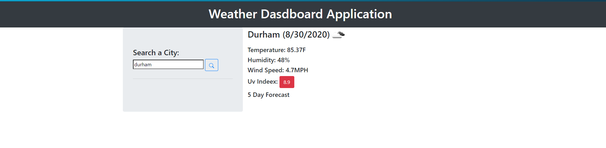

# Weather Dashboard

Designed for retrieving weather data from an API, used to support the application functionality to allow users to get real time weather updates. 

Technologies:  HTML, CSS, jQuery, Bootstrap Open Weather Map API.

## User Story

```
AS A traveler
I WANT to see the weather outlook for multiple cities
SO THAT I can plan a trip accordingly
```


## The following image demonstrates the application functionality:

*	Input City in the input field
*	Click Search Icon button
* Results will display on the right side



## Future Development:

* Support ability to render 5 day forecast

## Review


* The URL of the deployed application: https://jones-m12.github.io/Weather-Dashboard/

* The URL of the GitHub repository: https://github.com/Jones-M12/Weather-Dashboard.git

## Contact

* GitHub: [Jones-M12](https://github.com/Jones-M12) 

* Email: malesharj@gmail.com 

* LinkedIn: [m-jones89](https://www.linkedin.com/in/m-jones89/)


